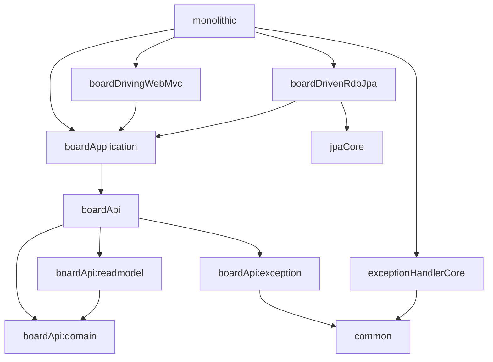

# blolet-multi-module-example
> Nettee Backend 팀의 backend-sample-hexagonal-simple-crud를 응용한 mulit-module 예시 입니다. 

## 📁 폴더 구조

```
blolet
├─common
├─core
│  ├─nettee-exception-handler-core [exceptionHandlerCore]
│  └─nettee-jpa-core [jpaCore]
├─monolithic
└─services
    └─board
        ├─api [boardApi]
        │  ├─domain [boardApi:domain]
        │  ├─exception [boardApi:exception]
        │  └─readmodel [boardApi:readmodel]
        ├─application  [boardApplication]
        ├─driven
        │  └─rdb
        │      └─jpa  [boardDrivenRdbJpa]
        └─driving
            └─rest
                └─web-mvc [boardDrivingWebMvc]
```

## 🐋 모듈 관계도

### ➡️ 의존 방향


