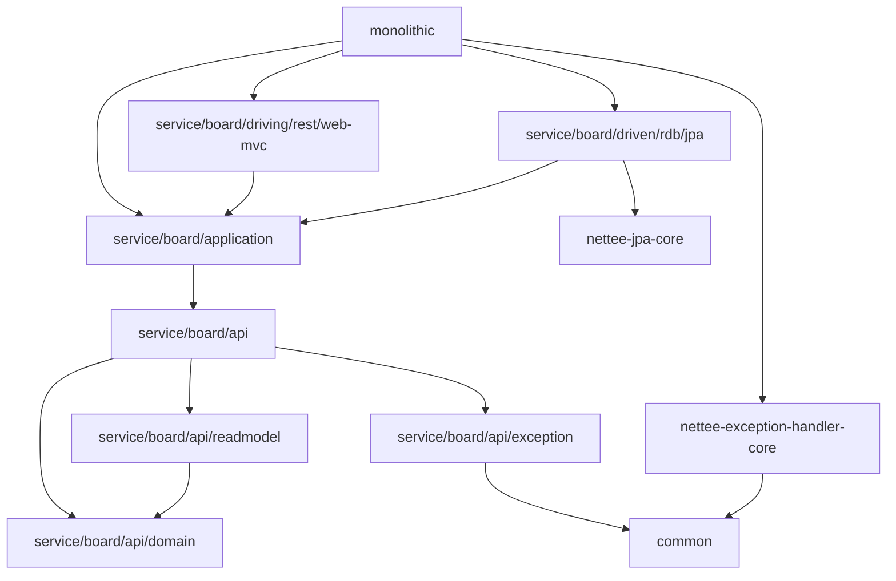

# blolet-multi-module-example
> Nettee Backend 팀의 backend-sample-hexagonal-simple-crud를 응용한 mulit-module 예시 입니다. 

## 📁 폴더 구조

```
blolet
├─common
├─core
│  ├─nettee-exception-handler-core
│  └─nettee-jpa-core
├─monolithic
└─services
    └─board
        ├─api
        │  ├─domain
        │  ├─exception
        │  └─readmodel
        ├─application
        ├─driven
        │  └─rdb
        │      └─jpa
        └─driving
            └─rest
                └─web-mvc
```

## 🐋 모듈 관계도

### ➡️ 의존 방향

