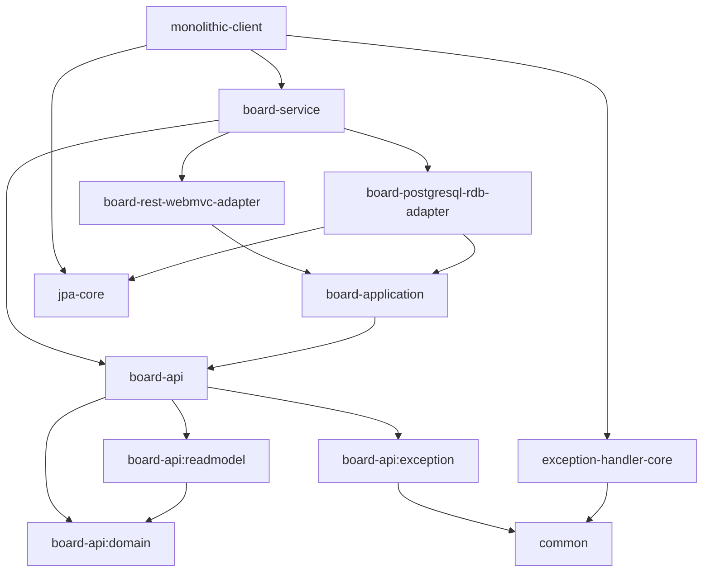

# blolet-multi-module-example
> Nettee Backend 팀의 backend-sample-hexagonal-simple-crud를 응용한 mulit-module 예시 입니다. 

## 📁 폴더 구조

```
blolet
├─common
├─core
│  ├─nettee-exception-handler-core [exception-handler-core]
│  └─nettee-jpa-core [jpa-core]
├─monolithic
└─services
    └─board
        ├─api [board-api]
        │  ├─domain [board-api:domain]
        │  ├─exception [board-api:exception]
        │  └─readmodel [board-api:readmodel]
        ├─application  [board-application]
        ├─driven
        │  └─rdb
        │      └─jpa  [board-postgresql-rdb-adapter]
        └─driving
            └─rest
                └─web-mvc [board-rest-webmvc-adapter]
```

## 🐋 모듈 관계도

### ➡️ 의존 방향


